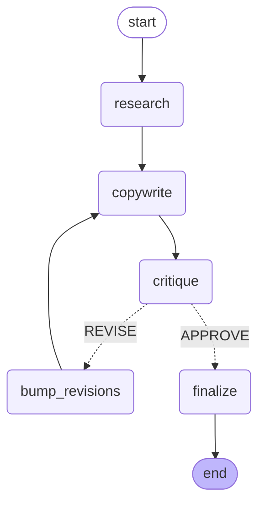

# AI Agency

A virtual consulting agency staffed entirely by AI agents. A user submits a brief; the agency self-organizes — CEO delegates, specialists execute, QA reviews — and delivers downloadable artifacts (PDF reports, PPTX decks, images).

Portfolio project demonstrating production-grade multi-agent orchestration: LangGraph supervisor pattern, two-tier model routing (Haiku + Sonnet), checkpointing, eval suite, observability.

**Status:** Week 6 / 6 — Shipped. Engineering notes + hire CTA live.
**Live:** [Dashboard](https://ai-agency-dashboard-omega.vercel.app) · [Sample run](https://ai-agency-dashboard-omega.vercel.app/runs/brabant-fintech-pricing) · [Eval](https://ai-agency-dashboard-omega.vercel.app/evaluation) · [Engineering notes](https://ai-agency-dashboard-omega.vercel.app/notes)
**Author:** Steven Sawarin · Tilburg, NL · srssdesing@gmail.com
**Stack:** Python 3.11+ · Google Gemini (Flash + Pro) · Tavily · LangGraph + SQLite checkpointer · Next.js 16 + Tailwind 4 · Independent-grader eval suite

---

## Quick start

```bash
# 1. Install deps (uv handles venv + install in one step)
uv sync

# 2. Copy env, fill in keys
cp .env.example .env
# Edit .env — add GOOGLE_AI_STUDIO_KEY and TAVILY_API_KEY

# 3. Run the FULL pipeline (Researcher -> Copywriter -> Critic loop)
uv run python -m backend.app.pipeline "Market analysis to launch a fitness app in the Netherlands"

# OR — run agents individually
uv run python -m backend.app.agents.researcher "Your brief here"
uv run python -m backend.app.agents.copywriter "Project name" --brief "original brief"
uv run python -m backend.app.agents.critic --draft data/deliverables/.../report-X.md

# Run tests
uv run pytest -v
```

Notes get saved to `data/notes/`. Deliverables (drafts + final) to `data/deliverables/`.

## Free-tier note

Google's free tier on Gemini 2.5 Flash gives **20 requests/day** and **5 RPM**. A single full pipeline run (Researcher + Copywriter + Critic, 1-3 revisions) eats ~12-18 requests. So you can run ~1 brief per day on the free tier, or unlock Tier 1 (linked billing, $300 credits) for ~150 RPM and no daily cap.

Once on Tier 1, pass `--no-pace` to disable the 15s inter-call delay:

```bash
uv run python -m backend.app.pipeline "Your brief" --no-pace
```

---

## 6-week compressed roadmap

| Week | Goal | Ship | Public artifact |
|---|---|---|---|
| **1** | Single-agent foundation | Researcher (web search → notes), raw Gemini SDK, CLI | ✅ GitHub repo + README |
| **2** | Multi-agent loop | Add Copywriter + Critic. Three-agent loop with max-3-revisions. Critic-approved sample deliverable. | ✅ `docs/sample-deliverables/` |
| **3** | LangGraph refactor | StateGraph, checkpointing, conditional routing as pure function. 30 unit tests. | ✅ Committed |
| **4** | UI + deployment | Next.js 16 dashboard, server components, restrained design system, Vercel deploy | ✅ [ai-agency-dashboard-omega.vercel.app](https://ai-agency-dashboard-omega.vercel.app) |
| **5** | Evaluation rigor | Eval framework: 15 briefs, baseline runner, independent grader, aggregate report. Headline finding: rubric scores don't capture source authenticity. | ✅ [/evaluation](https://ai-agency-dashboard-omega.vercel.app/evaluation) |
| **6** | Polish + hire signal | Engineering notes page (5 defensible decisions), hire CTA on landing, contact links throughout. | ✅ [/notes](https://ai-agency-dashboard-omega.vercel.app/notes) |

---

## Architecture — current (Week 3)

The agency runs as a LangGraph `StateGraph`. Each node wraps one of the agent functions; a conditional edge after the Critic implements the bounded revision loop.



**Why LangGraph (added in Week 3, not Week 1):** The Week 1-2 pipeline was a plain Python loop — easy to read, no framework. The graph rewrite adds three things that justify the abstraction:

1. **Checkpointing** — every state transition is persisted to `data/db/checkpoints.sqlite`. An interrupted run resumes from the last node via `--resume`.
2. **State as data** — every node returns a partial `AgencyState` delta. No hidden globals, easy to test (see `tests/test_graph.py`).
3. **Conditional routing as a function** — `decide_after_critic(state)` is a single pure function deciding APPROVE → finalize, REVISE → re-draft, or cap-reached → ship. Provably terminates.

## Architecture — target (Week 4-6)

```
                Next.js dashboard (week 4)
                       │
                       ▼
                FastAPI + WebSockets
                       │
                       ▼
                  LangGraph
       (CEO supervisor multiplexes more agents)
       /        |        |          \
Researcher  Copywriter  Strategist  Critic
       \        |        |          /
        Shared workspace (Postgres + pgvector)
                       │
                  LangSmith traces (week 5)
```

---

## Folder layout

```
ai-agency/
├── pyproject.toml         # uv-managed deps
├── .env.example           # template (copy to .env)
├── README.md
├── backend/
│   └── app/
│       ├── pipeline.py    # CLI entry — runs the graph
│       ├── graph.py       # LangGraph StateGraph + nodes + conditional edge
│       ├── state.py       # AgencyState TypedDict
│       ├── agents/        # one file per agent (pure functions, framework-free)
│       │   ├── researcher.py
│       │   ├── copywriter.py
│       │   └── critic.py
│       └── tools/         # tool implementations
│           ├── web_search.py
│           ├── notes_writer.py
│           └── report_writer.py
├── tests/                 # 30 unit tests, no API calls required
├── docs/
│   ├── sample-deliverables/   # real agent output saved as portfolio
│   └── build-log/             # weekly build-in-public posts
└── data/
    ├── notes/             # agent-generated notes (gitignored)
    ├── deliverables/      # draft + final reports (gitignored)
    └── db/                # checkpoints.sqlite (gitignored)
```

---

## Cost notes

- **Google Gemini** (against $300 trial credits):
  - 2.5 Flash ~$0.075/M input, $0.30/M output — used for Researcher (cheap, fast)
  - 2.5 Pro ~$1.25/M input, $5/M output — used for Strategist + Critic + Copywriter (reasoning)
  - Typical brief end-to-end with two-tier routing: ~$0.05-$0.20
- **Tavily** — free tier covers 1,000 searches/month. Plenty for development + eval suite.
- **Vercel** — free tier for the UI (weeks 4+).
- **Postgres** — local SQLite first, then local Postgres or Supabase free tier.

Budget for the whole 6 weeks: **~$5-$15** out of the $300 Google credits. Plenty of headroom for the eval suite.

The two-tier routing story (Flash for Researcher, Pro for reasoning agents) is one of the headline talking points for interviews — same architecture as Anthropic's Haiku/Sonnet pattern.

---

## Test brief library (build out in week 5)

Dutch-context briefs that signal Tilburg/Brabant relevance:

1. "Market analysis to launch a fitness app in the Netherlands"
2. "Competitive analysis for a Tilburg-area SaaS HR tool targeting SMBs"
3. "Pricing strategy for a B2B fintech entering Brabant manufacturing"
4. "Brand positioning for a Dutch sustainable e-commerce launch"
5. "Customer acquisition plan for a Tilburg restaurant chain expanding to Eindhoven"
6. *(+9 more)*

---

## Why this project

Mirrors what NL companies (CM.com, Vantage AI, Say Hai, Subduxion) sell in 2026. Built to demonstrate end-to-end senior engineering: agent design, cost-aware routing, evaluation, deployment, UX.

The interesting engineering decisions documented as I make them, posted publicly weekly. Build in public.
